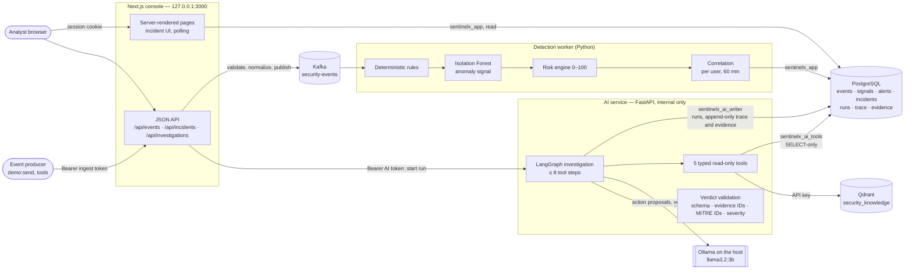
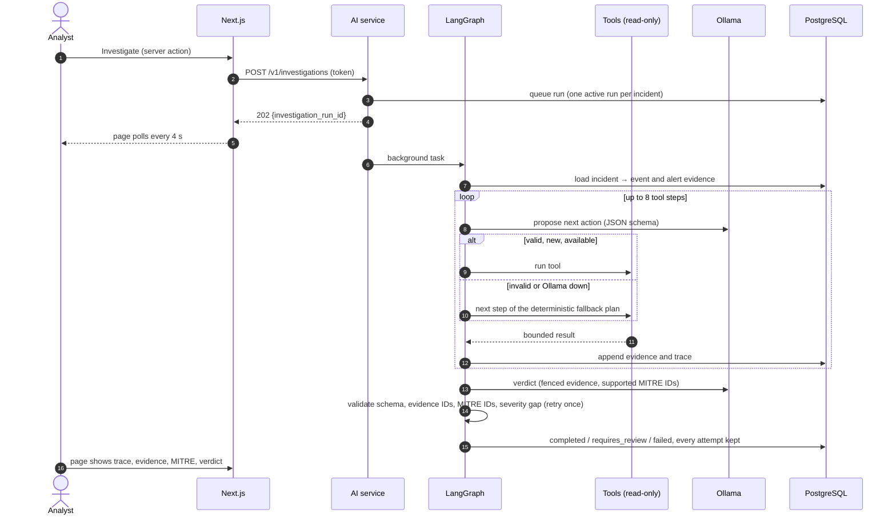

# 02 — Architecture

As built (Phases 00–13). The reasons behind each component, with the alternatives rejected, are in `docs/23_INTERVIEW_GUIDE.md`; every decision is in `progress/DECISIONS.md`.

## System

Trust boundaries:
- Only the console is published, on 127.0.0.1. The AI service accepts only the Next.js server's token, and in Compose it is not published at all.
- Each service connects to PostgreSQL as its own least-privilege role. The agent's tools can only read.
- The LLM sees code-written evidence claims and produces a verdict, which code validates before anyone sees it. The model never sets the risk score.

## Investigation sequence

## Deployment topologies
| | Development | Clean-machine demo |
|---|---|---|
| Command | `docker compose up -d` | `docker compose --profile app up -d --build` |
| In containers | PostgreSQL, Kafka, Qdrant | the same, plus `setup` and `knowledge` (one-shot), `web`, `detection`, `ai` |
| On the host | Next.js, the detection worker, the AI service, Ollama | Ollama only |
| Gate | `python scripts/verify.py` (24 checks) | `apps/web/demo-check` (docs/22) |

## Boundaries
- **Web** owns the UI, the session boundary and the user-facing APIs.
- **Detection** owns rules, features, the anomaly model, risk and correlation.
- **AI** owns LangGraph, the tools, retrieval, the LLM adapter, verdict validation and trace creation.
- **PostgreSQL** owns persistence. Drizzle migrations are the only DDL (D-010).

Cross-service payloads are versioned JSON Schemas in `contracts/v1/` (D-011, D-042, D-059).

Do not add a service without a concrete boundary and a documented reason.
